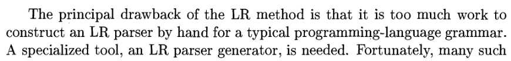

# LR Parser
---
## About:
The "[dragon book](https://en.wikipedia.org/wiki/Compilers:_Principles,_Techniques,_and_Tools)" on compilers has this to say about LR parsers:



True to its reputation, the book is blowing smoke.

This repository consists of an LR parser written in ~600 lines of Python, without using any code generation techniques or importing any libraries (except `re` from the standard library for regular expressions, which are used by the lexer, and `sys`, which is used by the REPL to exit).

Along with the parser, a lexer and an interpreter for a very basic programming language (which supports arithmetic expressions and assignments to variables) is included. Hopefully this dispels the myth that LR parsers cannot be handwritten.

Does it really work? Fire up the interpreter and see for yourself.

## Running:

There are no dependencies to install, so running the interpreter should be as easy as:
```
python3 main.py
```
You can type `\h` to see your options:
```
Enter an expression ('\h' for help or '\q' to quit):
>\h
Options:
\h \help
\q \quit
\l \lexer
\t \tokens
\r \rules
\a \ast
\e \env
\s \stack
```
We can determine which tokens the interpreter will recognize by using the `\lexer` command: 
```
>\lexer
Fixed tokens:
' ': SPACE
'_': BLANK
'(': OP
')': CP
'+': ADD
'-': SUBTRACT
'*': MULTIPLY
'/': DIVIDE
'->': ASSIGNMENT

Variable tokens:
"^\n$": NEWLINE
"^\t$": TAB
"^".*"$": STR
"^"[^"]*$": ERROR
"^[a-z]+\w*$": NAME
"^[A-Z]+\w*$": USER_TYPE
"^_?[a-z]+\w*$": ITER_FUNC_NAME
"^\d+$": INT
"^\d+\.\d*|(-\d+\.\d*)$": FLOAT
```

These tokens are read from the `language.tok` file. The "fixed" tokens have fixed lengths, and are wrapped by single quotation marks. The "variable" tokens may have variable lengths; they are wrapped by double quotation marks and are interpreted as regular expressions. 

There is also a `bnf.tok` file included in this repository, which is used by the lexer to tokenize .bnf grammar files; in particular, `grammar.bnf` which is the corresponding grammar file for `language.tok`. We can also view the rules generated from `grammar.bnf` by using the `\rules` command:

```
Rules:
<statement: ['expr', 'assignment', 'term']>
<statement: ['term', 'assignment', 'term']>
<assignment: ['ASSIGNMENT']>
<expr: ['expr', 'op', 'term']>
<expr: ['term', 'op', 'term']>
<term: ['NAME']>
<term: ['FLOAT']>
<term: ['INT']>
<term: ['STR']>
<term: ['OP', 'expr', 'CP']>
<term: ['OP', 'term', 'CP']>
<op: ['ADD']>
<op: ['SUBTRACT']>
<op: ['MULTIPLY']>
<op: ['DIVIDE']>
```

Let's go ahead and give the interpreter an expression:
```
>1+2+3+4 -> x
-> 10
```
The interpreter evaluated the expression, assigned the result to `x`, then returned the result. We can see how this expression was tokenized using the `\token` command:
```
>\tokens
[<INT: 1>, <ADD: '+'>, <INT: 2>, <ADD: '+'>, <INT: 3>, <ADD: '+'>, <INT: 4>, <ASSIGNMENT: '->'>, <NAME: 'x'>]
```

We can see how the LR parser evaluated the expression with the `\stack` command:
```
>\stack
stack:
['INT']
['term']
['term', 'ADD']
['term', 'op']
['term', 'op', 'INT']
['term', 'op', 'term']
['expr']
['expr', 'ADD']
['expr', 'op']
['expr', 'op', 'INT']
['expr', 'op', 'term']
['expr']
['expr', 'ADD']
['expr', 'op']
['expr', 'op', 'INT']
['expr', 'op', 'term']
['expr']
['expr', 'ASSIGNMENT']
['expr', 'assignment']
['expr', 'assignment', 'NAME']
['expr', 'assignment', 'term']
['statement']
```

We can view the abstract syntax tree generated by using the `\ast` command:
```
>\ast
ast:
node: {rule:<statement: ['expr', 'assignment', 'term']>}
	node: {rule:<expr: ['expr', 'op', 'term']>}
		node: {rule:<expr: ['expr', 'op', 'term']>}
			node: {rule:<expr: ['term', 'op', 'term']>}
				node: {rule:<term: ['INT']>  tok:<INT: 1>}
				node: {rule:<op: ['ADD']>  tok:<ADD: '+'>}
				node: {rule:<term: ['INT']>  tok:<INT: 2>}
			node: {rule:<op: ['ADD']>  tok:<ADD: '+'>}
			node: {rule:<term: ['INT']>  tok:<INT: 3>}
		node: {rule:<op: ['ADD']>  tok:<ADD: '+'>}
		node: {rule:<term: ['INT']>  tok:<INT: 4>}
	node: {rule:<assignment: ['ASSIGNMENT']>  tok:<ASSIGNMENT: '->'>}
	node: {rule:<term: ['NAME']>  tok:<NAME: 'x'>}
```

Finally, we can view the environment using the `\env` command:
```
>\env
env:
{<NAME: 'x'>: <INT: 10>}
>x
-> 10
```
Once variables are defined, they can be used in expressions:
```
>x+1
-> 11
```
Note that each command can also be called using only the first letter of the command, for those who prefer less typing.

### Order of operations:

Expressions are evaluated in order from left to right, and from inside out when wrapped in parentheses. For example `1-2-3-4` evaluates to `-8`:
```
>1-2-3-4
-> -8
>\ast
ast:
node: {rule:<expr: ['expr', 'op', 'term']>}
	node: {rule:<expr: ['expr', 'op', 'term']>}
		node: {rule:<expr: ['term', 'op', 'term']>}
			node: {rule:<term: ['INT']>  tok:<INT: 1>}
			node: {rule:<op: ['SUBTRACT']>  tok:<SUBTRACT: '-'>}
			node: {rule:<term: ['INT']>  tok:<INT: 2>}
		node: {rule:<op: ['SUBTRACT']>  tok:<SUBTRACT: '-'>}
		node: {rule:<term: ['INT']>  tok:<INT: 3>}
	node: {rule:<op: ['SUBTRACT']>  tok:<SUBTRACT: '-'>}
	node: {rule:<term: ['INT']>  tok:<INT: 4>}
```
However, with parentheses, a different tree is produced and the evaluation proceeds differently:
```
>1-(2-(3-4))
-> -2
>\ast
ast:
node: {rule:<expr: ['term', 'op', 'term']>}
	node: {rule:<term: ['INT']>  tok:<INT: 1>}
	node: {rule:<op: ['SUBTRACT']>  tok:<SUBTRACT: '-'>}
	node: {rule:<term: ['OP', 'expr', 'CP']>}
		node: {rule:<expr: ['term', 'op', 'term']>}
			node: {rule:<term: ['INT']>  tok:<INT: 2>}
			node: {rule:<op: ['SUBTRACT']>  tok:<SUBTRACT: '-'>}
			node: {rule:<term: ['OP', 'expr', 'CP']>}
				node: {rule:<expr: ['term', 'op', 'term']>}
					node: {rule:<term: ['INT']>  tok:<INT: 3>}
					node: {rule:<op: ['SUBTRACT']>  tok:<SUBTRACT: '-'>}
					node: {rule:<term: ['INT']>  tok:<INT: 4>}
```
Note that the LR parser stack gets significantly larger when parentheses force right-to-left evaluation, as in the example above:
```
>1-(2-(3-4))
-> -2
>\stack
stack:
['INT']
['term']
['term', 'SUBTRACT']
['term', 'op']
['term', 'op', 'OP']
['term', 'op', 'OP', 'INT']
['term', 'op', 'OP', 'term']
['term', 'op', 'OP', 'term', 'SUBTRACT']
['term', 'op', 'OP', 'term', 'op']
['term', 'op', 'OP', 'term', 'op', 'OP']
['term', 'op', 'OP', 'term', 'op', 'OP', 'INT']
['term', 'op', 'OP', 'term', 'op', 'OP', 'term']
['term', 'op', 'OP', 'term', 'op', 'OP', 'term', 'SUBTRACT']
['term', 'op', 'OP', 'term', 'op', 'OP', 'term', 'op']
['term', 'op', 'OP', 'term', 'op', 'OP', 'term', 'op', 'INT']
['term', 'op', 'OP', 'term', 'op', 'OP', 'term', 'op', 'term']
['term', 'op', 'OP', 'term', 'op', 'OP', 'expr']
['term', 'op', 'OP', 'term', 'op', 'OP', 'expr', 'CP']
['term', 'op', 'OP', 'term', 'op', 'term']
['term', 'op', 'OP', 'expr']
['term', 'op', 'OP', 'expr', 'CP']
['term', 'op', 'term']
['expr']
```

The interpreter also implements some basic type-checking and error handling:
```
>1+"hi"
type error: 1 (type int) does not match "hi" (type str)
>x y
parse error: check \stack
>1+2.0
type error: 1 (type int) does not match 2.0 (type float)
>1.+2.
-> 3.0
```
Note that ints are not automatically promoted to floats; consistent typing is enforced.

## Usage

This lexer-parser-interpreter is for learning purposes. Feel free to use it, just keep in mind it comes with no warranty whatsoever (whatever that means).

## Contributing

This project is purposely limited in scope. If you find any bugs, please feel free to file a ticket. However, please don't submit any PR's without first creating a ticket outlining the problem and your proposed solution.